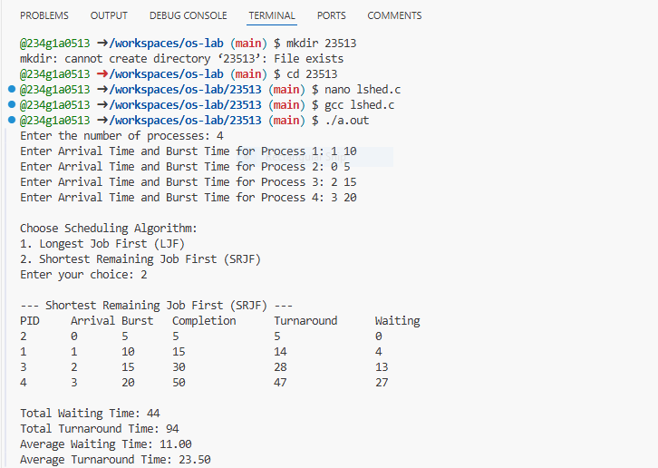
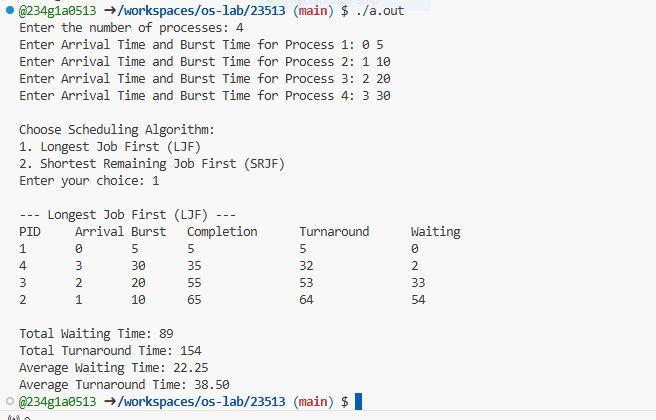

###Simulate LJF (langest job First) and SRJF (Shortest Remaining Job First) CPU Scheduling Algorithms
```c
#include <stdio.h>

typedef struct {
    int pid;
    int arrival_time;
    int burst_time;
    int remaining_time;
    int completion_time;
    int turnaround_time;
    int waiting_time;
} Process;

// Function to sort processes by Arrival Time
void sortByArrivalTime(Process proc[], int n) {
    for (int i = 0; i < n - 1; i++) {
        for (int j = i + 1; j < n; j++) {
            if (proc[i].arrival_time > proc[j].arrival_time) {
                Process temp = proc[i];
                proc[i] = proc[j];
                proc[j] = temp;
            }
        }
    }
}

// Function for Longest Job First (LJF) Scheduling
void LJF(Process proc[], int n) {
    sortByArrivalTime(proc, n);
    int time = 0, completed = 0;
    int total_waiting_time = 0, total_turnaround_time = 0;

    printf("\n--- Longest Job First (LJF) ---\n");
    printf("PID\tArrival\tBurst\tCompletion\tTurnaround\tWaiting\n");

    while (completed < n) {
        int max_burst_idx = -1, max_burst_time = -1;

        for (int i = 0; i < n; i++) {
            if (proc[i].arrival_time <= time && proc[i].remaining_time > 0 && proc[i].remaining_time > max_burst_time) {
                max_burst_time = proc[i].remaining_time;
                max_burst_idx = i;
            }
        }

        if (max_burst_idx == -1) {
            time++;
            continue;
        }

        Process *p = &proc[max_burst_idx];
        time += p->remaining_time;
        p->completion_time = time;
        p->turnaround_time = p->completion_time - p->arrival_time;
        p->waiting_time = p->turnaround_time - p->burst_time;
        p->remaining_time = 0;
        completed++;

        total_waiting_time += p->waiting_time;
        total_turnaround_time += p->turnaround_time;

        printf("%d\t%d\t%d\t%d\t\t%d\t\t%d\n", p->pid, p->arrival_time, p->burst_time, p->completion_time, p->turnaround_time, p->waiting_time);
    }

    printf("\nTotal Waiting Time: %d", total_waiting_time);
    printf("\nTotal Turnaround Time: %d", total_turnaround_time);
    printf("\nAverage Waiting Time: %.2f", (float)total_waiting_time / n);
    printf("\nAverage Turnaround Time: %.2f\n", (float)total_turnaround_time / n);
}

// Function for Shortest Remaining Job First (SRJF) Scheduling
void SRJF(Process proc[], int n) {
    sortByArrivalTime(proc, n);
    int time = 0, completed = 0;
    int total_waiting_time = 0, total_turnaround_time = 0;

    printf("\n--- Shortest Remaining Job First (SRJF) ---\n");
    printf("PID\tArrival\tBurst\tCompletion\tTurnaround\tWaiting\n");

    while (completed < n) {
        int min_remaining_idx = -1, min_remaining_time = 99999;

        for (int i = 0; i < n; i++) {
            if (proc[i].arrival_time <= time && proc[i].remaining_time > 0 && proc[i].remaining_time < min_remaining_time) {
                min_remaining_time = proc[i].remaining_time;
                min_remaining_idx = i;
            }
        }

        if (min_remaining_idx == -1) {
            time++;
            continue;
        }

        Process *p = &proc[min_remaining_idx];

        // Execute process for one time unit
        p->remaining_time--;
        time++;

        // If process is completed
        if (p->remaining_time == 0) {
            p->completion_time = time;
            p->turnaround_time = p->completion_time - p->arrival_time;
            p->waiting_time = p->turnaround_time - p->burst_time;
            completed++;

            total_waiting_time += p->waiting_time;
            total_turnaround_time += p->turnaround_time;

            printf("%d\t%d\t%d\t%d\t\t%d\t\t%d\n", p->pid, p->arrival_time, p->burst_time, p->completion_time, p->turnaround_time, p->waiting_time);
        }
    }

    printf("\nTotal Waiting Time: %d", total_waiting_time);
    printf("\nTotal Turnaround Time: %d", total_turnaround_time);
    printf("\nAverage Waiting Time: %.2f", (float)total_waiting_time / n);
    printf("\nAverage Turnaround Time: %.2f\n", (float)total_turnaround_time / n);
}

int main() {
    int n, choice;

    printf("Enter the number of processes: ");
    scanf("%d", &n);

    Process proc[n];

    for (int i = 0; i < n; i++) {
        proc[i].pid = i + 1;
        printf("Enter Arrival Time and Burst Time for Process %d: ", i + 1);
        scanf("%d %d", &proc[i].arrival_time, &proc[i].burst_time);
        proc[i].remaining_time = proc[i].burst_time; // Initialize remaining burst time
    }

    printf("\nChoose Scheduling Algorithm:\n");
    printf("1. Longest Job First (LJF)\n");
    printf("2. Shortest Remaining Job First (SRJF)\n");
    printf("Enter your choice: ");
    scanf("%d", &choice);

    if (choice == 1) {
        LJF(proc, n);
    } else if (choice == 2) {
        SRJF(proc, n);
    } else {
        printf("Invalid choice!\n");
    }

    return 0;
}

```



