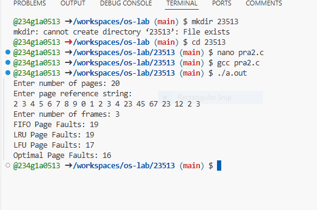

### To simulate Page replacement algorithm like FIFO, LRU, LFU and Optimal Algorithm
```c
#include <stdio.h>

#define MAX_FRAMES 10
#define MAX_PAGES 20

// Function to implement FIFO Page Replacement
void fifo(int pages[], int n, int frames) {
    int queue[MAX_FRAMES], front = 0, rear = 0, count = 0;
    int pageFaults = 0;

    for (int i = 0; i < n; i++) {
        int found = 0;
        for (int j = 0; j < count; j++) {
            if (queue[j] == pages[i]) {
                found = 1;
                break;
            }
        }
        if (!found) {
            if (count < frames) {
                queue[rear++] = pages[i];
                count++;
            } else {
                queue[front] = pages[i];
                front = (front + 1) % frames;
            }
            pageFaults++;
        }
    }
    printf("FIFO Page Faults: %d\n", pageFaults);
}

// Function to implement LRU Page Replacement
void lru(int pages[], int n, int frames) {
    int stack[MAX_FRAMES], count = 0;
    int pageFaults = 0;

    for (int i = 0; i < n; i++) {
        int found = 0, index = -1;
        for (int j = 0; j < count; j++) {
            if (stack[j] == pages[i]) {
                found = 1;
                index = j;
                break;
            }
        }
        if (!found) {
            if (count < frames) {
                stack[count++] = pages[i];
            } else {
                for (int k = 1; k < count; k++)
                    stack[k - 1] = stack[k];
                stack[count - 1] = pages[i];
            }
            pageFaults++;
        } else {
            for (int k = index; k < count - 1; k++)
                stack[k] = stack[k + 1];
            stack[count - 1] = pages[i];
        }
    }
    printf("LRU Page Faults: %d\n", pageFaults);
}

// Function to implement LFU Page Replacement
void lfu(int pages[], int n, int frames) {
    int frame[MAX_FRAMES], freq[MAX_FRAMES] = {0}, count = 0;
    int pageFaults = 0;

    for (int i = 0; i < n; i++) {
        int found = 0, index = -1;
        for (int j = 0; j < count; j++) {
            if (frame[j] == pages[i]) {
                found = 1;
                freq[j]++;
                break;
            }
        }
        if (!found) {
            if (count < frames) {
                frame[count] = pages[i];
                freq[count] = 1;
                count++;
            } else {
                int minIdx = 0;
                for (int k = 1; k < count; k++) {
                    if (freq[k] < freq[minIdx])
                        minIdx = k;
                }
                frame[minIdx] = pages[i];
                freq[minIdx] = 1;
            }
            pageFaults++;
        }
    }
    printf("LFU Page Faults: %d\n", pageFaults);
}

// Function to implement Optimal Page Replacement
void optimal(int pages[], int n, int frames) {
    int frame[MAX_FRAMES], count = 0;
    int pageFaults = 0;

    for (int i = 0; i < n; i++) {
        int found = 0;
        for (int j = 0; j < count; j++) {
            if (frame[j] == pages[i]) {
                found = 1;
                break;
            }
        }
        if (!found) {
            if (count < frames) {
                frame[count++] = pages[i];
            } else {
                int farthest = -1, replaceIdx = -1;
                for (int j = 0; j < frames; j++) {
                    int nextUse = n;
                    for (int k = i + 1; k < n; k++) {
                        if (frame[j] == pages[k]) {
                            nextUse = k;
                            break;
                        }
                    }
                    if (nextUse > farthest) {
                        farthest = nextUse;
                        replaceIdx = j;
                    }
                }
                frame[replaceIdx] = pages[i];
            }
            pageFaults++;
        }
    }
    printf("Optimal Page Faults: %d\n", pageFaults);
}

int main() {
    int pages[MAX_PAGES], n, frames;
    
    printf("Enter number of pages: ");
    scanf("%d", &n);
    printf("Enter page reference string:\n");
    for (int i = 0; i < n; i++)
        scanf("%d", &pages[i]);
    
    printf("Enter number of frames: ");
    scanf("%d", &frames);
    
    fifo(pages, n, frames);
    lru(pages, n, frames);
    lfu(pages, n, frames);
    optimal(pages, n, frames);
    
    return 0;
}
```

